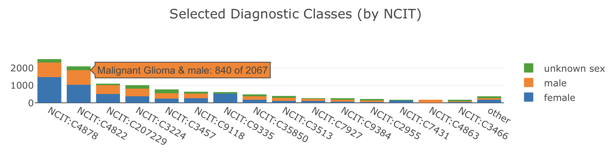

# Data Summaries ("Aggregations")

## Overview

!!! warning

    This is the work in progress for a general aggregation/summary documentation.
    The most recent version is currently maintained at [bycon.progenetix.org/data-summaries/](https://bycon.progenetix.org/data-summaries/).

Data summaries (also referred to as "aggregations") are summary statistics delivered
beacons. They can reflect different aspects of the beacon's content, such as:

* static overview of the content of a resource
* content of the resources's collections (datasets or cohorts in the Beacon model)
* dynamically generated summaries of query results

Typical summaries reflect the count of value occurrences for individual properties (1-dimensional, "1D")
or the intersection of two properties (2-dimensional aggregations, "2D").

!!! info "Further Info"

    * [Proposals for Aggregated Response](https://github.com/ga4gh-beacon/beacon-v2/discussions/238)

!!! info "Fast Overview Using Test Implementations on Progenetix/beaconPlus"

    In spirit of the tried and tested "implementation driven development"
    we provide full stack implementations on top of the [Progenetix](https://progenetix.org)
    resource through the [`bycon` framework](https://bycon.progenetix.org).

    The examples below link to the staging instance of Progenetix with - fully
    functional - test versions of aggregation responses (which obviously might
    change along with the schema proposal).

    * [`/aggregation_terms/` endpoint response](https://staging.progenetix.org/beacon/aggregation_terms/)
    * [Example aggregation response for TCGA cancer samples](https://staging.progenetix.org/beacon/biosamples/?requestedGranularity=aggregated&filters=pgx:cohort-TCGAcancers&aggregationTerms=ageAtDiagnosisBySex)
        - This is a `resultSets` response for the `/biosamples/` endpoint with
          `requestedGranularity=aggregated` and using the `ageAtDiagnosisBySex`
          aggregation term known from the `/aggregation_terms/` call above
        - the summaries are reported in `resultSets.n.resultsAggregation`
    * Age/sex distribution for brain cancer samples shown in a [dashboard](https://staging.progenetix.org/queryResultsDashboard/?filters=NCIT:C3268&aggregationTerms=ageAtDiagnosisBySex)
    * [Content dashboard for the Progenetix data](https://staging.progenetix.org/dataDashboard/)
        - This is purely a showcase for 1 and 2 dimensional representations w/o
          any refinements. However, based on the JavaScript version of [plotly](https://plotly.com/)
          it provides some hints for the "front-end vs. back-end" discussions
          (e.g. the library automatically allows to subset on the 2nd dimension
          w/o any additional code or back-end support).
        - One outcome of this implementation is the ambiguity of "other", "undefined",
          "not reported" - which might need some specification for congruency.

#### Scope of the summary counts

!!! question "On which entity are the summaries reported?"

    Do the summaries have to be projected to the requested entity, or can they
    be reported on basis of pre-defined entities (e.g. can a request to `/individuals/`
    report the numbers for the matched sample histologies or the individuals with the
    matched histologies?.

## General Structure and Calling

Aggregation responses or summary data are called by setting the `requestedGranularity`
to `aggregated`. Example:

* samples in Progenetix
    - <https://staging.progenetix.org/beacon/biosamples/?requestedGranularity=aggregated&datasetIds=progenetix&filters=pgx:cohort-TCGAcancers>
    - <https://staging.progenetix.org/beacon/biosamples?requestedGranularity=aggregated&datasetIds=progenetix&aggregationTerms=ageAtDiagnosisBySex&filters=NCIT:C3268>
    
The aggregation types to be returned can be specified by using the additional
request `aggregationTerms` parameter as well as optional parameters for binning or
term selection (==TBD==). Example:

* Age groups labeled by sex for TCGA cancer individuals in Progenetix
    - <https://staging.progenetix.org/beacon/biosamples/?requestedGranularity=aggregated&filters=pgx:cohort-TCGAcancers&aggregationTerms=ageAtDiagnosisBySex>
    - age/sex distribution for brain cancer samples shown in a plot <https://staging.progenetix.org/queryResultsDashboard/?datasetIds=progenetix&filters=NCIT:C3268&aggregationTerms=ageAtDiagnosisBySex>
    

## Components

Empowering aggregation responses or summary data relies on several components:

* schema definitions
* data aggregation pipelines
* an informational response for about supported summaries (similar to the `/filtering_terms/` endpoint)
* request parameters for selecting summary types
    - `aggregationTermIds`, also suitable for `GET` requests
    - `aggregationTerms` for `POST`ed aggregation schemas
    - additional reuest parameters for modifying responses (e.g. limits, binning...)
* the response format for the summaries
* the front end logic - which is not part of this itself but serves for understanding
  requirements and test formats

??? question "Why not using `filters` as aggregation terms?"

    While it would be possible to use `filters` to define aggregation terms,
    this would lead to confusion as filters are primarily used to define
    query constraints. Additionally filters have different formats which
    would be problematic to handle in aggregation contexts:

    * `ontologyTerm` filter are a type of "valued filters" where a the aggregation
      on the filtering term would lead to a single count response; _i.e._ all the
      different terms existing at the property would have to be indicated
    * `alphanumeric` filters consist of `id` (mapping to a concept), an `operator`
      and a `value`; here an aggregation would only make sense on the `concept`
      part with or without indicators for a binning of the values but not by providing
      the values themselves.

    Therefore, a separate, property based mechanism for defining aggregation
    terms is preferred.


### Aggregation Schema Definitions

Aggregation schema definitions are necessary to define the types of aggregations
supported by a Beacon implementation. These definitions should include:

* the `id` of the aggregation
* a `label`, e.g. used as a title in visualisations
* a `description` of what the aggregation represents, e.g. used for info tooltips
* the `concepts` involved in the aggregation
    - usually one or 2 ("dimensions"); see below
* additional parameters for modifying the aggregation behaviour or indicating
  behavior
    - `sorted: true` can indicate to a client that a response has a predefined order
    
#### Concept definitions and parameters

Each `concept` involved in an aggregation should be defined with:

* the scoped `property`, _i.e._ property in the respective entity to be aggregated
    - TODO: In cases of object style properties (e.g. `id, label` ontology terms)
      we currently define it as specific field (e.g. `individual.diseases.diseaseCode.id`)
      instead of the logical concept (`individual.diseases.diseaseCode`). This might
      be changed if necessary.
* optional modifiers:
    - `termIds` for specifying terms to be included in the aggregation
    - `splits` for specifying how to split the values (e.g. binning for
      numeric or pseudo-numeric values such as ISO8601 durations for ages)
        * at this time `splits` seem as the best way to specify binning, but this might
          be changed later on
        * `splits` also correspond nicely to database aggregation concepts such
          as `$buckets` and `$splits` in MongoDB

### Examples

#### Single property aggregation

```
id: sampleOriginDetails
label: Anatomical Origin
description: >-
  Count of anatomical sites in matched biosamples
concepts:
  - property: biosample.sample_origin_detail.id
```

#### Single property aggregation with `splits`

The following example includes pre-defined age group splits which can be overridden by a request parameter (to be defined; probably best to have it in a POST object):

```
id: ageAtSampleCollection
label: Age at Sampling
description: >-
  Age at collection of the sample
sorted: True
concepts:
  - property: biosample.collectionMoment
    splits:
      - P0D
      - P18M
      - P18Y
      - P40Y
      - P65Y
      - P80Y
      - P120Y
```

#### Single property aggregation with `termIds`

```
id: selectedCarinomaDiagnoses
label: Selected Diagnostic Classes (carcinomas; by NCIT)
description: >-
  Count of histological diagnoses in matched biosamples for selected carcinomas
scope: biosample
concepts:
  - property: biosample.histological_diagnosis.id
    termIds:
      - NCIT:C9384 # Kidney Carcinoma
      - NCIT:C3513 # Esophageal Carcinoma
      - NCIT:C35850 # Head and Neck Carcinoma
      - NCIT:C4878 # Lung Carcinoma
      - NCIT:C207229 # Pancreatic Carcinoma
      - NCIT:C4911 # Gastric Carcinoma
      - NCIT:C2955 # Colorectal Carcinoma
      - NCIT:C7927 # Liver Carcinoma
```

#### 2-dimensional aggregation

```
id: diseaseBySex
label: Sex distributions for Diseases
description: 
  - ICD-O 3 histologies by sex in matched biosamples
concepts:
  - property: individual.diseases.diseaseCode.id
  - property: individual.sex.id
```

#### More than 2 dimensions

While the Beacon specification currently predicts 1- or 2-dimensional summaries
in principle the protocol is open for higher dimensional intersections.

??? note "3-dimensional summary example"

    ```
    id: cancerTypesBySexAndCountry
    label: Cancer types (by sex and origin)
    scope: biosample
    concepts:
      - property: biosample.histological_diagnosis.id
      - property: biosample.individual_info.sex.id
      - property: biosample.geo_location.properties.ISO3166alpha3
    description:
      - Cancer type by sex and country of origin in matched biosamples
    distribution:
      - conceptValues:
        - id: NCIT:C4017
          label: Breast Ductal Carcinoma
        - id: NCIT:C16576
          label: female
        - id: USA
          label: USA
        count: 264
      - conceptValues:
        - id: NCIT:C2919
          label: Prostate Adenocarcinoma
        - id: NCIT:C20197
          label: male
        - id: USA
          label: USA
        count: 238
      - conceptValues:
        - id: NCIT:C4017
          label: Breast Ductal Carcinoma
        - id: NCIT:C16576
          label: female
        - id: DEU
          label: DEU
        count: 66
      ...
    ```
    ... etc.


## Client: Dashboard Generation

One of the main use cases for aggregation responses is to generate data dashboards.
These dashboards can provide visual summaries of the data content of the resource,
either as static overviews or dynamically generated views based on user queries.

**Client or beacon side configurations?** While the actual rendering of dashboards
is typically a client-side task, some aspects of dashboard generation might _in principle_
be influenced through beacon-side configurations. Examples here could be the limiting
of responses (e.g. "top 10 diagnoses") and the determination of visualisation types
for certain aggregations. Here some recommendation scan be provided (==WiP==):

* clients should be able to request an upper limit for the number of categories
  to be returned for a given aggregation term (==TBD: parameter name==)
* rendering styles are defined client side w/o Beacon parameters

### Example Dashboard Implementation using Plotly.js

[{ style="float: right; margin: -40px 0px 10px 30px; width: 150px" }](https://plotly.com/javascript/)


#### Data Transforms


##### 1D Summary to _Bar or Pie Chart_

A "1D" summary aggregation involves a single property and reports a `distribution`
array where each item contains:

* a list of 1 `conceptValues` (with `id` and `label`)
* a `count`

An example summary response (here using the GeoJSON tagging for biosamples in
Progenetix - not a standard Beacon property yet) would look like this:

```javascript
resultsAggregation: [ {
    id: "sampleCountries",
    label: "Sample Countries",
    scope: "biosample",
    concepts: [ { property: "biosample.geo_location.properties.ISO3166alpha3" } ],
    description: "Count of countries of origin in matched biosamples",
    distribution: [
      {
        conceptValues: [ { id: 'USA', label: 'United States' } ],
        count: 389
      },
      {
        conceptValues: [ { id: 'CHE', label: 'Switzerland' } ],
        count: 17
      },
      { 
        conceptValues: [ { id: null, label: null } ],
        count: 16
      }
    ]
} ]
```

`Plotly.js` implements 1- and 2-dimensional charts through data `traces`, _i.e._ lists
of one or more `trace` objects containing e.g. lists for `x` and `y` values and
optional chart information. 

An example for a single data trace derived from the
1D summary above would look like:

```javascript
{
  x: [ 'USA', 'CHE', null ],
  y: [ 389, 17, 16 ],
  hovertext: [ 'United States: 389', 'Switzerland: 17', 'null: 16' ]
}
```

The transformation from a Beacon summary to a [Plotly trace for a bar chart](https://plotly.com/javascript/bar-charts/)
can be achieved through e.g.:

```javascript
let x = [];
let y = [];
let hovertext = [];

distribution.forEach( (item) => {
    x.push( item.conceptValues[0].id );
    y.push( item.count );
    hovertext.push( `${item.conceptValues[0].label}: ${item.count}` );
} );
let trace = { type: "bar", x: x, y: y, hovertext: hovertext, hoverinfo: "text" };
```

{ style="float: left; margin: 0px 50px 10px 0px; width: 350px" }

Here, `hovertext` is an optional addition for better interactivity and `type: "bar"`
could also be `type: "pie"` for pie charts. Obviously, additional data manipulation
(filtering, sorting, calculation of summary for "other" values...) will be needed.


This example shows a pie chart for a similar 1D summary generated
through `SimplePlotlyPie` in [`bycon`'s dashboard implementation](https://github.com/progenetix/bycon/blob/main/beaconplusWeb/src/components/summaries/).

##### 2D Summary to _Stacked Bar Chart_

Creation of a stacked bar chart from a 2D aggregation response requires some data processing to collate all the
different values for the 2nd dimension per value of the 1st dimension / independent axis.
In the data structure of the 2D (or more than 2...) Beacon summary responses one would usually use **first concept** for the independent axis; however, the data structure would also allow to swap this.

Processing Beacon summaries for a stacked bar chart requires to:

* identify all unique values for the 1st and 2nd concept
    - the first concept here defines the `x` axis categories
        * example: diagnosis codes
    - the second concept defines the split instances of observations
        * example: sex (per diagnosis)
* create a data trace for each unique value of the 2nd concept
     - each trace will contain `x` and `y` values for all unique values of the 1st concept (e.g. `diagnosis`)
       for the observations matching the 2nd concept value (e.g. `male`)

An example implementation targeting `Plotly.js` based visualization can be found as WiP inside the [`bycon/beaconplusWeb/` code ](https://github.com/progenetix/bycon/blob/main/beaconplusWeb/src/components/summaries/).


/// caption
A stacked bar chart generated in Plotly.js from a Beacon summary response for a 2D aggregation.
The `hovertext` shows the breakdown of counts per category, with the "label" of
the 2nd concept shown in the legend and hover text.
///


##### Sankey diagrams

Sankey diagrams are another way to visualise 2D (or more) aggregations. The data
of a Beacon summary distribution can be transformed for Sankey charts by creating

* a single list of unique nodes (_i.e._ `id` values) for all concept values in both dimensions
* mapping each co-occurrence of 2 concept values to a `source` and `target` index in the node list
  along with the respective `count` as `value`


/// caption
This example for a Sankey chart shows the relation of binned age values and sex
for ~15000 individuals in Progenetix with a match for a focal copy number deletion
involving the CDKN2A locus, generated as a life response using the the [`bycon` code ](https://github.com/progenetix/bycon/) for summary response and Plotly.js based the [visualization](https://github.com/progenetix/bycon/blob/main/beaconplusWeb/src/components/summaries/). No styling added `¯\_(ツ)_/¯`
///  

